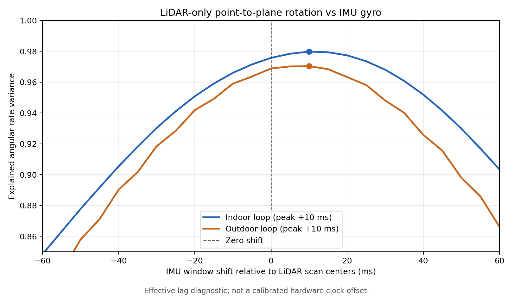

# MID-360 时间偏移候选与速度/轨迹对比（2026-10-06）

## 结论

仅使用现有 `室内闭环`、`室外闭环` MCAP，独立点云配准与 IMU 角速度的相关性都在约 `+10 ms` 的**有效时间窗平移**处达到宽峰。它不是已标定的 MID-360 硬件时钟偏移：点云是约 100 ms 的滚动扫描，配准结果所代表的具体扫描时刻不确定，而且原始包 `time_type` 未录入 MCAP。

在隔离配置中将 FAST-LIO2 的 `time_offset_lidar_to_imu` 从 `0` 改为 `+0.01 s` 后，室外路线的首末平移间隔变小，室内路线只有三维间隔略变小，水平间隔与姿态夹角反而变大。两种配置均按 1× 速度完成回放，建图主循环平均耗时接近。**没有独立轨迹真值或物理起终点测量，暂不把 `+0.01 s` 写入默认配置。**

## 独立运动相关检查

脚本仅从原始点云的相邻扫描做点到点初值、点到面配准，以此估计 LiDAR 转动；随后在不同时间窗平移下与原始 IMU 角速度拟合。它不使用 FAST-LIO2 的里程计作为输入。拟合时同时求解固定坐标旋转和幅值比例；“解释比例”是该模型对角速度变化的拟合量，不能当定位精度。

| 录包 | 合格扫描对 | 点到面残差中位数 | 全段最佳有效平移 | 角速度变化解释比例 | 幅值比例 | 前/后半段最佳平移 |
| --- | ---: | ---: | ---: | ---: | ---: | ---: |
| 室内闭环 | 940 | 1.53 cm | +10 ms | 0.980 | 0.958 | +10 / +10 ms |
| 室外闭环 | 2,592 | 2.36 cm | +10 ms | 0.970 | 0.886 | +10 / +5 ms |

零平移时，室内和室外的解释比例已分别达到 0.976 和 0.969；从 0 到 +10 ms 的提升分别只有约 0.004 和 0.002，峰顶较宽。点到面配准的几何残差、滚动扫描畸变、动态物体和配准选点也会影响峰值，因此只能将 +10 ms 视为后续实验候选，不能直接认定传感器延迟为 10 ms。

## FAST-LIO2 隔离 A/B

两种配置除 `time_offset_lidar_to_imu` 外完全相同：点云采样与体素参数保持当前值，开启运行时间日志，关闭 RViz 与 PCD 保存，使用相同录包和 1× 回放。每组各运行一次。`主循环平均耗时`取当前源码运行日志末尾的累计平均 `ave total`，计时在后续点云发布前结束，不能视为完整端到端延迟。

| 录包 | 偏移 | 里程计条数 | 估计路程 | 首末三维间隔 | 首末水平间隔 | 首末姿态夹角 | 主循环平均耗时 |
| --- | ---: | ---: | ---: | ---: | ---: | ---: | ---: |
| 室内闭环 | 0 ms | 935 | 24.52 m | 6.92 cm | 3.96 cm | 0.81° | 2.211 ms |
| 室内闭环 | +10 ms | 935 | 24.51 m | 6.62 cm | 4.47 cm | 1.15° | 2.257 ms |
| 室外闭环 | 0 ms | 2,571 | 230.49 m | 9.32 cm | 6.05 cm | 2.46° | 4.301 ms |
| 室外闭环 | +10 ms | 2,571 | 230.24 m | 7.84 cm | 3.54 cm | 2.54° | 4.289 ms |

四次播放进程均以状态码 0 结束；室内和室外里程计最大相邻时间戳间隔分别约 104 ms、103 ms，没有超过 150 ms 的间隔。两种配置都跟上了这台机器的离线 1× 回放，现阶段没有观察到建图主循环算力不足。这个结论限于 RViz、PCD 保存关闭的测试条件；当前常用配置开启了更多输出，实时设备的端到端负载仍未测得。

先前室内包的原始基线运行曾得到 938 条里程计、6.00 cm 的首末三维间隔；本次开启耗时日志的零偏移复跑为 935 条、6.92 cm。这种运行差异与本次候选带来的小幅变化处于相近量级，更不能把单次首末间隔变化当作精度提升。当前并未测量实际回到同一物理点的误差，也未比较地图墙面重影。

## 处理决定

（1）`src/FAST_LIO/config/mid360.yaml` 继续保持 `time_sync_en: false`、`time_offset_lidar_to_imu: 0.0`，不修改在线外参、点采样或体素参数。

（2）先用 `evaluation/TIMING_AUDIT_2026-10-06.md` 的结果界定现有 MCAP 证据。若以后能重新采集，应保存原始数据包的 `time_type`，再用独立时间/外参标定与真值路线确认偏移；得到可信时间基准后，才对精度参数做多次 A/B。

（3）若优化目标是实时速度，先在实际运行条件下测主循环、点云发布、RViz 和 PCD 保存的完整耗时与积压；这次离线测试不支持直接下调点数或体素分辨率来换速度。

`evaluation/estimate_motion_lag.py` 与 `evaluation/run_offset_playback.py` 保留了这次探索的复查方法；执行方式见 `evaluation/README.md`。原始包和生产默认配置没有改动。
