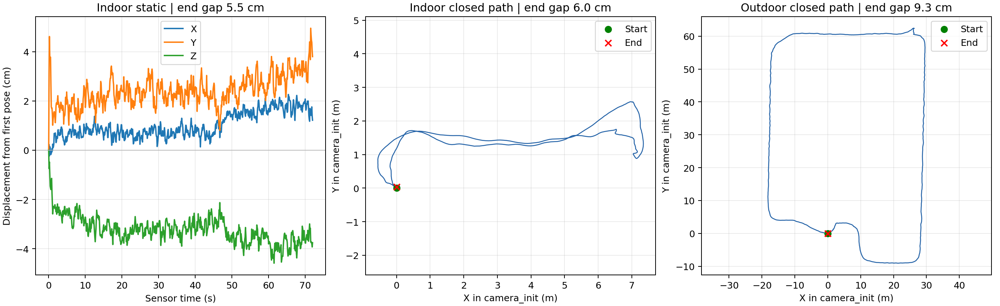

#### 1 测试范围
2026-10-06 使用 `/home/h/lidar_ws/bags` 中三个录包进行离线测试：`室内静止`、`室内闭环`、`室外闭环`。测试环境为 ROS 2 Jazzy；FAST_LIO 固定在 `a4743b095409588842a5b30ddfa27e29d2f99164` 并应用仓库补丁，Livox 驱动固定在 `21445540f0d100dc86a7e6df312dd70bbdb4afdf` 并应用网络配置补丁。本次不连接实时雷达。
（1）直接读取 MCAP 消息，检查点云和 IMU 的时间戳、点数、扫描时长及原始扫描时间窗（raw scan window）的 IMU 覆盖。
（2）按原速 `ros2 bag play --clock 100 -r 1.0` 回放，FAST-LIO2 使用仿真时间，关闭 RViz 与 PCD 保存；同时运行 `mid360_monitor`，订阅并保存 `/Odometry`。
（3）闭合偏差（closure gap）是第一条与最后一条里程计（odometry）估计位置之间的三维距离。轨迹长度是相邻估计位置的累计距离。两者都不是真值误差。
#### 2 原始录包检查

| 录包 | LiDAR 帧 | IMU 条 | 传感器时间跨度 | 最大 LiDAR 间隔 | 最大 IMU 间隔 | 完整 IMU 覆盖 |
| --- | ---: | ---: | ---: | ---: | ---: | ---: |
| 室内静止 | 730 | 14,590 | 73.01 s | 101.17 ms | 8.16 ms | 729/730 |
| 室内闭环 | 941 | 18,814 | 94.13 s | 102.51 ms | 8.71 ms | 940/941 |
| 室外闭环 | 2,594 | 52,158 | 260.79 s | 1,400.00 ms | 6.83 ms | 2,593/2,594 |

三包点云约 10 Hz、每帧约 20,000 点，IMU 约 200 Hz；消息时间戳均严格递增，`point_num` 与实际点数一致，LiDAR `header.stamp` 与 `timebase` 一致，扫描时长均在 50–150 ms。每包唯一未判“完整覆盖”的扫描都是录制首帧：包内没有更早的 IMU 样本，属于边界证据不足。包内未见 IMU 间隔超过 15 ms。
室外包另有一处 LiDAR 时间戳间隔 1.400 s，发生在开头约 1.5 s、前 17 帧附近；同期 IMU 时间戳连续。该包开头消息的“录制时间减传感器时间”约 3 s，随后逐渐减小，说明录制开头有积压或延迟的迹象；仅凭 MCAP 不能定位发生在设备、驱动还是录包进程。此间隔不在后续闭合路线的中段。
#### 3 FAST-LIO2 回放输出
三组 bag 播放进程都以状态码 0 结束，FAST-LIO2 均完成 IMU 初始化、地图树初始化并持续发布 `camera_init → body` 的 `/Odometry`。包结束后脚本主动发送 SIGINT 停止节点，因此启动日志末尾的 `exit code -2` 是收尾信号，不是播放期间崩溃。启动前监测节点的 `NO_DATA` 以及首帧的 `START_UNKNOWN` 不计作录制故障。静止包回放的首个有效监测窗口出现 `WARN` 和 129.60 ms 的接收侧 IMU 间隔；直接读取原始包时最大 IMU 时间戳间隔为 8.16 ms，其余回放窗口正常，因此这次告警反映回放启动时订阅者收到的数据不完整，不能据此判定原始包丢 IMU。

| 录包 | 里程计条数 | 估计轨迹长度 | 首末平移间隔 | 水平间隔 | 首末姿态夹角 |
| --- | ---: | ---: | ---: | ---: | ---: |
| 室内静止 | 721 | 不适用 | 5.48 cm | 3.99 cm | 0.49° |
| 室内闭环 | 938 | 24.53 m | 6.00 cm | 3.17 cm | 0.93° |
| 室外闭环 | 2,571 | 230.49 m | 9.32 cm | 6.05 cm | 2.46° |

室内静止包的估计位置相对第一条位姿最大偏离 6.37 cm。用同一包和整理后的脚本复跑一次，得到 721 条里程计、首末平移间隔 4.08 cm、首末姿态夹角 0.52°；这表明结果可以复现到厘米量级，但不同运行的末值不是逐位相同。静止是否绝对无运动，仍需外部证据。
室内、室外两条“闭环”是录包名称所描述的运动路径。这里只能说估计轨迹的起终点接近；无法确认操作者是否准确回到同一物理点，也没有地面真值，因此不能把 6.00 cm 或 9.32 cm 当作定位精度、APE 或回环优化效果。此次关闭了地图文件保存，没有检查点云墙面重影或地图几何质量。



#### 4 另一个需要留意的接口问题
静止包 `/livox/imu` 的加速度模长均值约 0.991。MID-360 [官方协议](https://github.com/Livox-SDK/livox_wiki_en/blob/master/source/tutorials/new_product/mid360/livox_eth_protocol_mid360.md)将加速度单位定义为 `g`；当前 [Livox 驱动代码](https://github.com/Livox-SDK/livox_ros_driver2/blob/21445540f0d100dc86a7e6df312dd70bbdb4afdf/src/lddc.cpp)直接将该数值写入 `sensor_msgs/Imu.linear_acceleration`，而 [ROS 2 Jazzy 的消息定义](https://github.com/ros2/common_interfaces/blob/jazzy/sensor_msgs/msg/Imu.msg)要求 `m/s²`。这表明该话题的加速度数值与 ROS 消息约定不一致。当前 FAST-LIO2 源码在 IMU 处理中按初始平均加速度模长重新缩放；其他直接消费该话题的节点不能假定数值已是 `m/s²`。本次未改驱动或重新验证改单位后的建图行为。
#### 5 复现命令与证据
先按仓库根目录 README 构建工作空间，确保三个原始 bag 仍在 `bags/室内静止`、`bags/室内闭环`、`bags/室外闭环`，关闭正在运行的 FAST-LIO2，然后执行：
```bash
cd ~/lidar_ws
bash evaluation/run_all.sh
```
逐组复跑、输出字段和隔离方式见 `evaluation/README.md`。结果写到 Git 忽略的 `evaluation/results/`，其中保留每组输入统计 JSON、`odometry.csv`、轨迹摘要 JSON、监测/FAST-LIO/播放日志、运行状态和三组轨迹图。
原始 MCAP 的 SHA-256：
```text
室内静止/mid360_20261005_221124_0.mcap  e7df74cb77bbb17b4e00fbff764ddcfa3fd9e160980f80161a1aeaadd8b65ba9
室内闭环/mid360_20261005_221708_0.mcap  914f354ae7d9b5794bbf8bcb62f4410d9803ab452364a3ba34113220c99de032
室外闭环/mid360_20261005_223558_0.mcap  c4059e12b7c5569729eb2c071ceaf49ad0afbe43f0e22d0a43c830888854ad9f
```
可用 `sha256sum ~/lidar_ws/bags/*/*.mcap` 核对文件是否与本次测试相同。测试证明这些离线包在当前源码与环境下可处理并给出上述估计轨迹；没有验证实时雷达运行、外参真值、绝对精度或地图几何质量。
